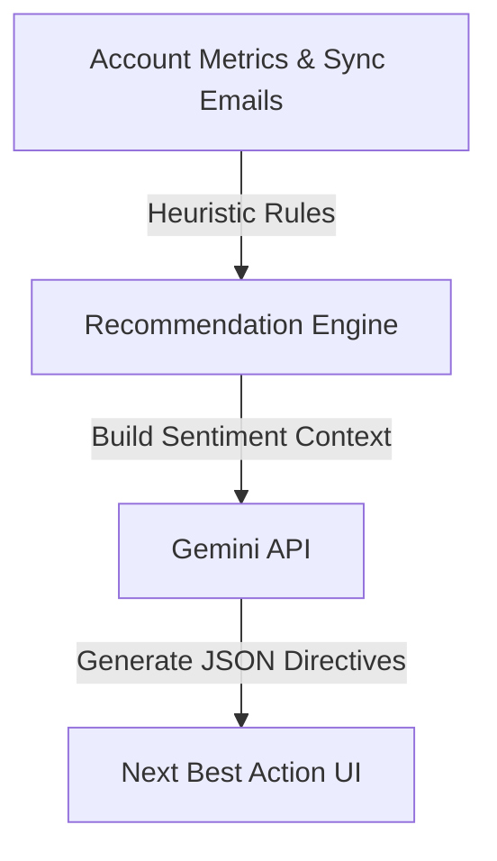

# AI Orchestration Architecture

Describes how AI models analyze customer telemetry data.

```mermaid
graph TD
    Input[Account Metrics & Sync Emails] --> |Heuristic Rules| Engine[Recommendation Engine]
    Engine --> |Build Sentiment Context| LLM[Gemini API]
    LLM --> |Generate JSON Directives| SuccessCard[Next Best Action UI]
```