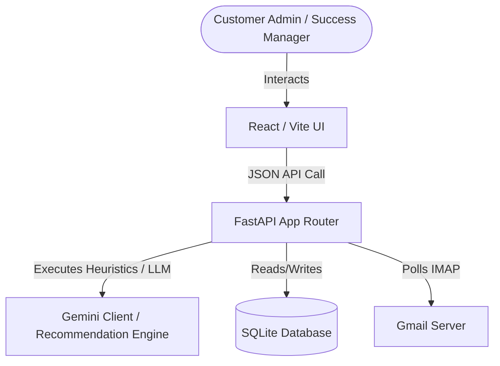

# System Architecture

DecisionFlow AI utilizes a modular architecture coupling a responsive React dashboard, a FastAPI server layer, and a SQLite telemetry store.

```mermaid
graph TD
    User([Customer Admin / Success Manager]) --> |Interacts| FE[React / Vite UI]
    FE --> |JSON API Call| BE[FastAPI App Router]
    BE --> |Executes Heuristics / LLM| AI[Gemini Client / Recommendation Engine]
    BE --> |Reads/Writes| DB[(SQLite Database)]
    BE --> |Polls IMAP| Gmail[Gmail Server]
```