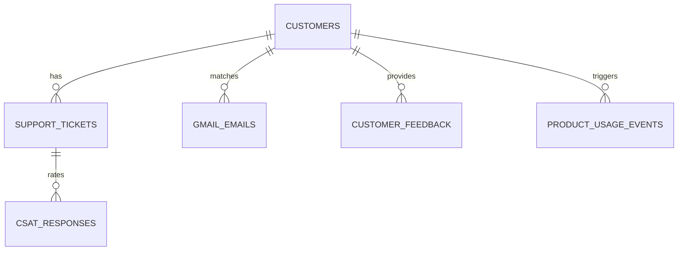

# Database Schema Documentation

DecisionFlow AI supports SQLAlchemy mapped models with local SQLite in development and optional PostgreSQL in production environments.

## Tables Relationships Diagram (ERD)

## Table Specifications

### 1. `customers`
Stores client companies registered with their support parameters.
- `id` (INTEGER, Primary Key)
- `company_name` (VARCHAR)
- `email` (VARCHAR)
- `domain` (VARCHAR)
- `health_score` (INTEGER)
- `risk_level` (VARCHAR)

### 2. `product_usage_events`
- `id` (INTEGER, Primary Key)
- `customer_id` (INTEGER, Foreign Key)
- `employee_id` (VARCHAR)
- `action` (VARCHAR)
- `module` (VARCHAR)
- `timestamp` (DATETIME)